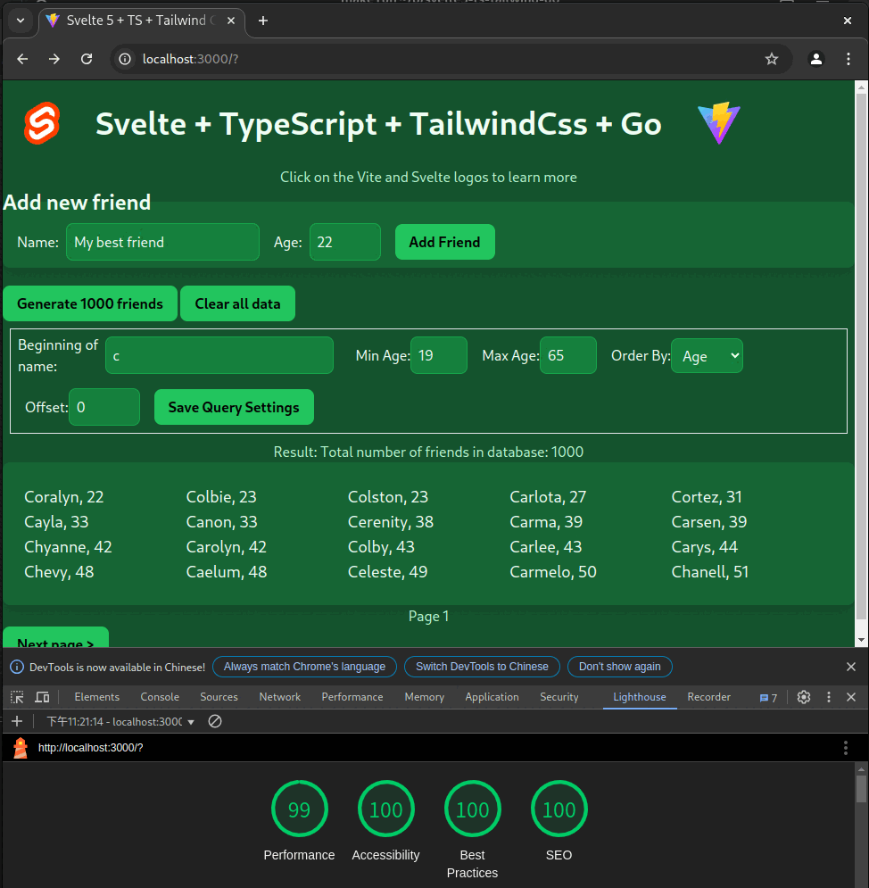

# Svelte5 + TS + Tailwind CSS 4 + Go

[demo site](https://dlintw.github.io/svelte5-ts-tailwind-go/)



This project aims to create a template for a full-stack web application. In
addition to the original Svelte-TS template, this project offers the following features:

- Pass Chrome Lighthouse tests: Ensures optimal performance, accessibility, and
  best practices.
- Single binary build with `make`: Automatically rebuilds the binary based on
  changes in either the frontend or backend code.
- License compliance with `make licensecheck`: Utilizes free Software
  Composition Analysis (SCA) tools to verify licenses.
- Enhanced code quality with `make lint`: Performs comprehensive checks beyond
  the default compiler settings.
- Consistent code formatting with `make fmt`: Ensures uniform code style before
  committing changes.

## setup related tools of this project

After clone this source, require some dependencies by `make setup`.

## Commit log mapping to build up steps

Just use `git log`, you can learn how to build up this template.

## common commands

- develop frontend `bun dev` or `bun dev --host --port 3000`
- build frontend `bun run build`
- build backend `go build`

type `make help` for more information. type
Before contribution to this project, please pass these.

```sh
make
make fmt
make lint
make licensecheck
```

## Recommended IDE Setup

[VS Code](https://code.visualstudio.com/) + [Svelte](https://marketplace.visualstudio.com/items?itemName=svelte.svelte-vscode).

## Original README of vite's template-svelte-ts

<https://github.com/vitejs/vite/tree/main/packages/create-vite/template-svelte-ts>

## What I use to built this project

- [Svelte • Web development for the rest of us](https://svelte.dev/)
- [Tailwind CSS - Rapidly build modern websites without ever leaving your HTML.](https://tailwindcss.com/)
- [Dexie.js - Minimalistic IndexedDB Wrapper](https://dexie.org/)
- [The Go Programming Language](https://go.dev/)
- [TypeScript: JavaScript With Syntax For Types.](https://www.typescriptlang.org/)
- [Vite | Next Generation Frontend Tooling](https://vite.dev/)
